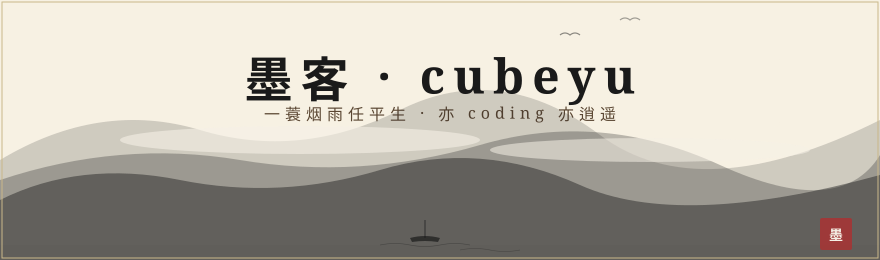
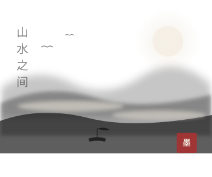
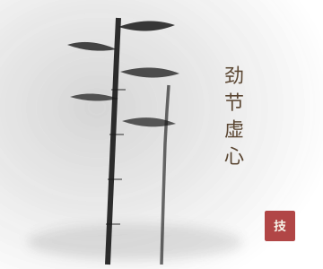
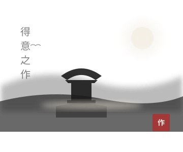
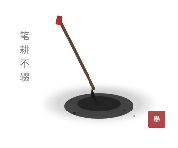
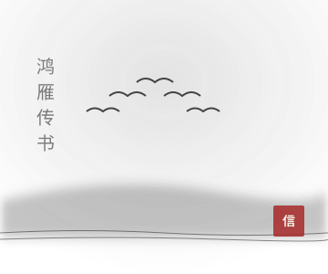

<!-- 古风水墨 · GitHub 个人简介 v4.1 · 左右交替卡片布局 · 暗色适配 -->

  <picture>
  <source media="(prefers-color-scheme: dark)" srcset="./hero-main-dark.svg"/>
  
</picture>

 

  余姓字 <strong style="color:#a83232;">cubeyu</strong>，栖身代码之境，游走于字节之间。 
  性好古风，独爱水墨之韵；亦慕代码之巧，乐见开源之盛。 
  愿以键盘为笔，屏幕为纸，行间写山水，帧里绘春秋。

  
  
  

 

<picture>
  <source media="(prefers-color-scheme: dark)" srcset="./svg/divider-seal-dark.svg"/>
  
</picture>

<!-- ════════════ 壹 · 吾之简介（文左 · 图右） ════════════ -->

<picture>
  <source media="(prefers-color-scheme: dark)" srcset="./svg/section-about-dark.svg"/>
  
</picture>

<table align="center" width="100%" border="0" style="border-collapse:separate; border-spacing:14px 10px;">
  <tr>
    <td width="50%" valign="middle" style="background-color:#f7f1e3; border:1px solid #c9b88a; border-radius:14px; box-shadow:0 3px 14px rgba(60,40,20,0.14); padding:18px 22px; font-family:STKaiti,KaiTi,楷体,STFangsong,FangSong,仿宋,serif; color:#2c2c2c; font-size:15px; line-height:1.95;">
      
栖身代码 · 游走字节

      余姓字 <strong style="color:#a83232;">cubeyu</strong>，栖身代码之境，游走于字节之间。 
      性好古风，独爱水墨之韵；亦慕代码之巧，乐见开源之盛。 
      以键盘为笔，屏幕为纸；行间写山水，帧里绘春秋。
    </td>
    <td width="50%" align="center" valign="middle" style="background-color:#f7f1e3; border:1px solid #c9b88a; border-radius:14px; box-shadow:0 3px 14px rgba(60,40,20,0.14); padding:10px;">
      <picture>
  <source media="(prefers-color-scheme: dark)" srcset="./svg/ink-landscape-dark.svg"/>
  
</picture>
    </td>
  </tr>
</table>

 

<!-- ════════════ 贰 · 所学技艺（图左 · 文右） ════════════ -->

<picture>
  <source media="(prefers-color-scheme: dark)" srcset="./svg/section-skills-dark.svg"/>
  
</picture>

<table align="center" width="100%" border="0" style="border-collapse:separate; border-spacing:14px 10px;">
  <tr>
    <td width="50%" align="center" valign="middle" style="background-color:#f7f1e3; border:1px solid #c9b88a; border-radius:14px; box-shadow:0 3px 14px rgba(60,40,20,0.14); padding:10px;">
      <picture>
  <source media="(prefers-color-scheme: dark)" srcset="./svg/ink-bamboo-dark.svg"/>
  
</picture>
    </td>
    <td width="50%" valign="middle" style="background-color:#f7f1e3; border:1px solid #c9b88a; border-radius:14px; box-shadow:0 3px 14px rgba(60,40,20,0.14); padding:18px 22px; font-family:STKaiti,KaiTi,楷体,STFangsong,FangSong,仿宋,serif; color:#2c2c2c; font-size:15px; line-height:1.9; text-align:center;">
      
工欲善其事，必先利其器。 以下诸般技艺，皆吾涉猎之所长：

      
— 言语 —

      
      
       
      
      
      
— 框架 —

      
      
       
      
      
      
— 器用 —

      
      
       
      
      
    </td>
  </tr>
</table>

 

<!-- ════════════ 叁 · 得意之作（文左 · 图右） ════════════ -->

<picture>
  <source media="(prefers-color-scheme: dark)" srcset="./svg/section-projects-dark.svg"/>
  
</picture>

<table align="center" width="100%" border="0" style="border-collapse:separate; border-spacing:14px 10px;">
  <tr>
    <td width="50%" valign="middle" style="background-color:#f7f1e3; border:1px solid #c9b88a; border-radius:14px; box-shadow:0 3px 14px rgba(60,40,20,0.14); padding:18px 22px; font-family:STKaiti,KaiTi,楷体,STFangsong,FangSong,仿宋,serif; color:#2c2c2c; font-size:15px; line-height:2;">
      
码海拾遗 · 聊记数作

      
作品整理中，容日后续录。

      <!--
      <strong style="color:#a83232;"><a href="https://github.com/cubeyu" style="color:#a83232; text-decoration:none;">project-one</a></strong> · 一方天地，藏星海之微光 
      <strong style="color:#a83232;"><a href="https://github.com/cubeyu" style="color:#a83232; text-decoration:none;">project-two</a></strong> · 半卷诗书，掩世俗之烟火 
      <strong style="color:#a83232;"><a href="https://github.com/cubeyu" style="color:#a83232; text-decoration:none;">project-three</a></strong> · 一壶浊酒，醉看代码生花
      -->
      

        
      

    </td>
    <td width="50%" align="center" valign="middle" style="background-color:#f7f1e3; border:1px solid #c9b88a; border-radius:14px; box-shadow:0 3px 14px rgba(60,40,20,0.14); padding:10px;">
      <picture>
  <source media="(prefers-color-scheme: dark)" srcset="./svg/ink-pavilion-dark.svg"/>
  
</picture>
    </td>
  </tr>
</table>

 

<!-- ════════════ 肆 · 笔耕不辍（图左 · 文右） ════════════ -->

<picture>
  <source media="(prefers-color-scheme: dark)" srcset="./svg/section-stats-dark.svg"/>
  
</picture>

<table align="center" width="100%" border="0" style="border-collapse:separate; border-spacing:14px 10px;">
  <tr>
    <td width="50%" align="center" valign="middle" style="background-color:#f7f1e3; border:1px solid #c9b88a; border-radius:14px; box-shadow:0 3px 14px rgba(60,40,20,0.14); padding:10px;">
      <picture>
  <source media="(prefers-color-scheme: dark)" srcset="./svg/ink-brush-dark.svg"/>
  
</picture>
    </td>
    <td width="50%" valign="middle" style="background-color:#f7f1e3; border:1px solid #c9b88a; border-radius:14px; box-shadow:0 3px 14px rgba(60,40,20,0.14); padding:18px 22px; font-family:STKaiti,KaiTi,楷体,STFangsong,FangSong,仿宋,serif; color:#2c2c2c; font-size:15px; line-height:1.9; text-align:center;">
      码田深耕，未尝懈怠； 一砖一瓦，皆成风景。
      
       
      
       
      
    </td>
  </tr>
</table>

 

<!-- ════════════ 伍 · 鸿雁传书（文左 · 图右） ════════════ -->

<picture>
  <source media="(prefers-color-scheme: dark)" srcset="./svg/section-contact-dark.svg"/>
  
</picture>

<table align="center" width="100%" border="0" style="border-collapse:separate; border-spacing:14px 10px;">
  <tr>
    <td width="50%" valign="middle" style="background-color:#f7f1e3; border:1px solid #c9b88a; border-radius:14px; box-shadow:0 3px 14px rgba(60,40,20,0.14); padding:18px 22px; font-family:STKaiti,KaiTi,楷体,STFangsong,FangSong,仿宋,serif; color:#2c2c2c; font-size:15px; line-height:1.95; text-align:center;">
      
山水有相逢

      愿与诸君论道技术、共话开源。 
      若得片言，幸甚至哉。
      

        
        
      

    </td>
    <td width="50%" align="center" valign="middle" style="background-color:#f7f1e3; border:1px solid #c9b88a; border-radius:14px; box-shadow:0 3px 14px rgba(60,40,20,0.14); padding:10px;">
      <picture>
  <source media="(prefers-color-scheme: dark)" srcset="./svg/ink-goose-dark.svg"/>
  
</picture>
    </td>
  </tr>
</table>

 

<picture>
  <source media="(prefers-color-scheme: dark)" srcset="./svg/footer-bamboo-dark.svg"/>
  
</picture>

  山高水长，后会有期 · 愿与诸君共论技术

<picture>
  <source media="(prefers-color-scheme: dark)" srcset="./svg/footer-signature-dark.svg"/>
  
</picture>

